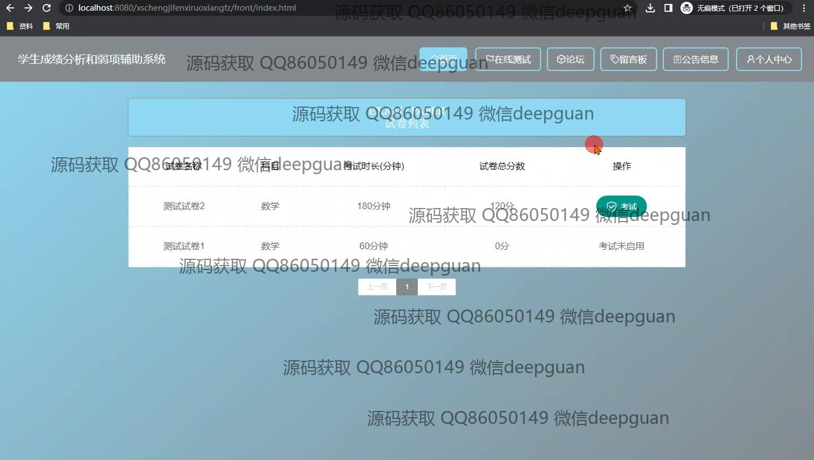
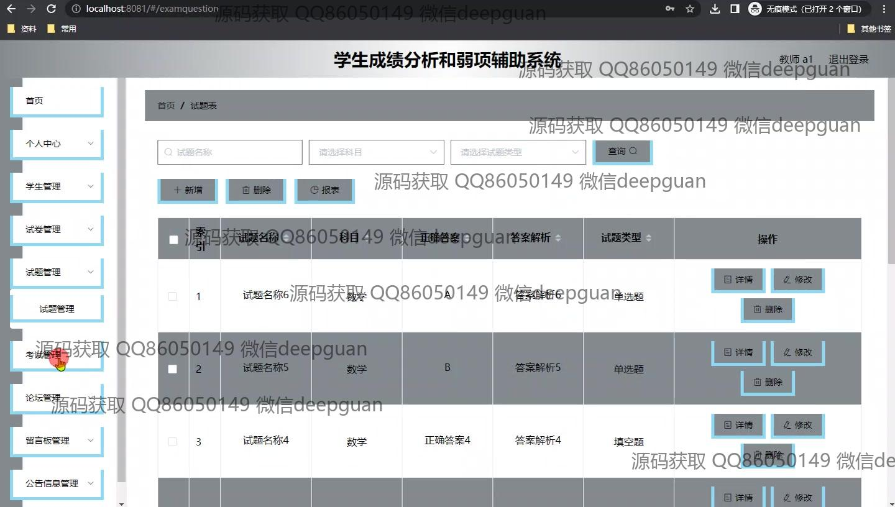

<h1 align="center">学生成绩分析和弱项辅助系统设计</h1>

## 简介
学生成绩分析和弱项辅助系统：角色分为管理员、教师和学生；提供成绩分析、试卷管理、在线测试、论坛互动、留言板功能，有助于优化学习体验和成绩提升。    --计算机毕业设计源码；毕设源码；java毕业设计源码

## 联系方式

<h3 align="center">获取完整代码与数据库文件 + 微信：deepguan QQ: 86050149 QQ群: 783742310</h3>

<h3 align="center">可帮忙远程部署 包运行成功！提供远程部署、修改代码、设计文档指导、代码讲解等服务！</h3>

## 功能介绍（完整见运行截图）
管理员：管理员可以访问系统后台管理界面，通过左侧导航菜单管理系统模块，包括试卷管理、试题管理、学生管理、教师管理、考试管理和操作日志管理。可查看和编辑操作日志、教师和学生信息，并支持增加、删除用户、重置密码、修改信息等操作。管理员还能管理论坛、留言板等用户交互模块，确保系统的有序运行。

教师：教师可以登录系统后的个人中心，查看和管理学生信息、发布和管理试卷，编辑试题，查看学生的考试成绩和分析报告。教师可以使用系统提供的功能，如试卷组卷、试题分数和类型设置，创建和组织考试活动，有效评估学生表现并识别其学习薄弱环节。

学生：学生通过系统提供的在线考试模块参加考试，可在试卷列表中查看试卷名称、考试时长、科目和总分数等信息。学生能够在论坛和留言板与同学和教师互动，发表和查看帖子、评论及参与讨论，利用系统分析自己的考试成绩和学习薄弱环节，并得到相应的学习改进帮助。

游客：游客可以浏览公共的系统页面，如登录注册页面和系统简介，但只有注册用户可以访问个人中心、参与考试和论坛互动。游客可通过注册成为学生或教师用户，利用系统提供的相关学习和管理功能，更深入地参与到学生成绩分析和弱项辅助活动中去。

## 运行截图

本代码来源于网络,仅供学习参考使用!

